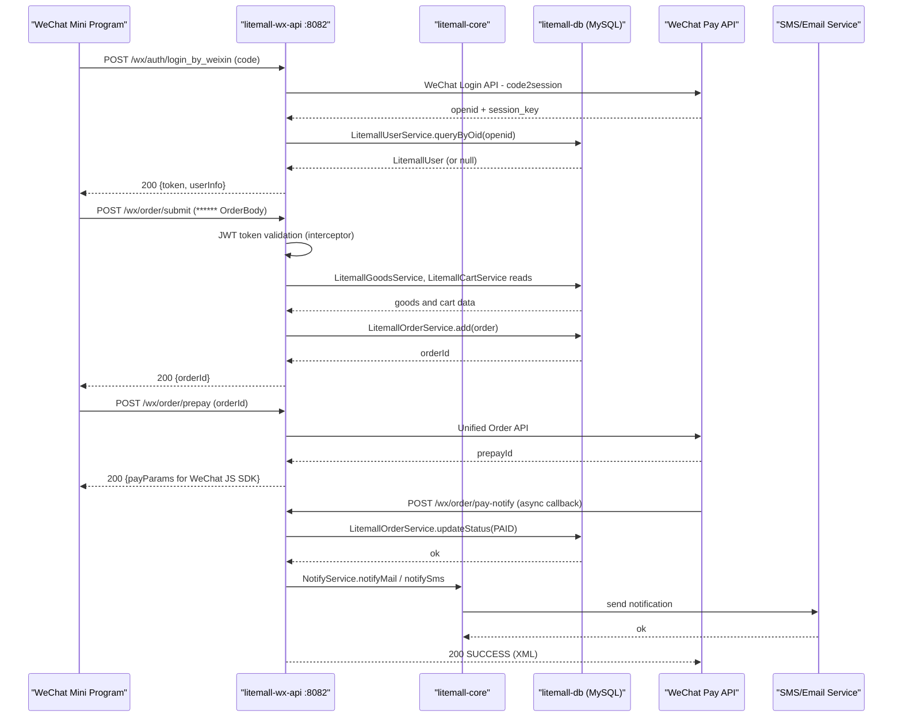

# API & Service Communication Contracts

Litemall exposes two independently deployable REST APIs—a WeChat Mini Program API (~70 endpoints on port 8082) and an Admin back-office API (~100 endpoints on port 8083)—both following synchronous HTTP/JSON communication with no inter-service messaging layer.

## Service Catalog

| Service | Port | Category | Purpose |
|---|---|---|---|
| litemall-wx-api | 8082 | API Layer | REST API for WeChat Mini Program storefront (products, cart, orders, auth, groupon, coupons) |
| litemall-admin-api | 8083 | API Layer | REST API for admin back-office (goods, orders, users, config, roles, stats) |
| litemall-db | internal | Business | Shared data access module; provides DB services and MyBatis mappers to both APIs |
| litemall-core | internal | Infrastructure | Shared infrastructure module; provides storage, notifications, scheduling, and express tracking |

## API Endpoints Inventory

### WeChat API (litemall-wx-api, port 8082)

| Controller | Method | Path | Description |
|---|---|---|---|
| WxAuthController | POST | /wx/auth/login | Username/password login |
| WxAuthController | POST | /wx/auth/login_by_weixin | WeChat OAuth login |
| WxAuthController | POST | /wx/auth/register | New user registration |
| WxAuthController | POST | /wx/auth/reset | Password reset |
| WxAuthController | POST | /wx/auth/captcha | Send SMS captcha |
| WxAuthController | POST | /wx/auth/regCaptcha | Send registration captcha |
| WxAuthController | GET | /wx/auth/info | Get current user info |
| WxAuthController | POST | /wx/auth/profile | Update user profile |
| WxAuthController | POST | /wx/auth/bindPhone | Bind phone number |
| WxAuthController | POST | /wx/auth/resetPhone | Reset bound phone |
| WxAuthController | POST | /wx/auth/logout | Logout |
| WxGoodsController | GET | /wx/goods/list | Goods list with filters |
| WxGoodsController | GET | /wx/goods/detail | Goods detail |
| WxGoodsController | GET | /wx/goods/category | Goods by category |
| WxGoodsController | GET | /wx/goods/related | Related goods |
| WxGoodsController | GET | /wx/goods/count | Total goods count |
| WxCartController | GET | /wx/cart/index | Cart contents |
| WxCartController | POST | /wx/cart/add | Add item to cart |
| WxCartController | POST | /wx/cart/fastadd | Fast add (buy now) |
| WxCartController | POST | /wx/cart/update | Update cart item |
| WxCartController | POST | /wx/cart/delete | Remove cart items |
| WxCartController | POST | /wx/cart/checked | Toggle item selection |
| WxCartController | GET | /wx/cart/goodscount | Item count badge |
| WxCartController | GET | /wx/cart/checkout | Pre-order summary |
| WxOrderController | POST | /wx/order/submit | Place order |
| WxOrderController | POST | /wx/order/prepay | WeChat Pay pre-payment |
| WxOrderController | POST | /wx/order/h5pay | H5 Pay |
| WxOrderController | POST | /wx/order/pay-notify | WeChat Pay async callback |
| WxOrderController | GET | /wx/order/list | Order list |
| WxOrderController | GET | /wx/order/detail | Order detail |
| WxOrderController | GET | /wx/order/goods | Order goods |
| WxOrderController | POST | /wx/order/cancel | Cancel order |
| WxOrderController | POST | /wx/order/confirm | Confirm receipt |
| WxOrderController | POST | /wx/order/delete | Delete order |
| WxOrderController | POST | /wx/order/refund | Request refund |
| WxOrderController | POST | /wx/order/comment | Post comment |
| WxCouponController | GET | /wx/coupon/list | Available coupons |
| WxCouponController | GET | /wx/coupon/mylist | My coupons |
| WxCouponController | GET | /wx/coupon/selectlist | Coupon selection for checkout |
| WxCouponController | POST | /wx/coupon/receive | Claim coupon |
| WxCouponController | POST | /wx/coupon/exchange | Exchange coupon code |
| WxGrouponController | GET | /wx/groupon/list | Group-buy activity list |
| WxGrouponController | GET | /wx/groupon/detail | Group-buy detail |
| WxGrouponController | GET | /wx/groupon/join | Join group-buy |
| WxGrouponController | GET | /wx/groupon/my | My group-buys |
| WxAddressController | GET | /wx/address/list | Address book |
| WxAddressController | GET | /wx/address/detail | Address detail |
| WxAddressController | POST | /wx/address/save | Save address |
| WxAddressController | POST | /wx/address/delete | Delete address |
| WxCatalogController | GET | /wx/catalog/index | Category index |
| WxCatalogController | GET | /wx/catalog/all | All categories |
| WxCatalogController | GET | /wx/catalog/current | Current category |
| WxCatalogController | GET | /wx/catalog/getfirstcategory | L1 categories |
| WxCatalogController | GET | /wx/catalog/getsecondcategory | L2 categories |
| WxStorageController | POST | /wx/storage/upload | File upload |
| WxStorageController | GET | /wx/storage/fetch/{key} | Fetch stored file |
| WxStorageController | GET | /wx/storage/download/{key} | Download stored file |
| WxSearchController | GET | /wx/search/index | Search results |
| WxSearchController | GET | /wx/search/helper | Search suggestions |
| WxSearchController | POST | /wx/search/clearhistory | Clear search history |
| WxAftersaleController | GET | /wx/aftersale/list | After-sale requests list |
| WxAftersaleController | GET | /wx/aftersale/detail | After-sale detail |
| WxAftersaleController | POST | /wx/aftersale/submit | Submit after-sale request |
| WxAftersaleController | POST | /wx/aftersale/cancel | Cancel after-sale |
| WxCollectController | GET | /wx/collect/list | Wishlist |
| WxCollectController | POST | /wx/collect/addordelete | Toggle wishlist item |
| WxMsgController | GET | /wx/msg/config | WeChat message config verify |
| WxMsgController | POST | /wx/msg/config | Receive WeChat message push |
| WxHomeController | GET | /wx/home/index | Home page data |
| WxHomeController | GET | /wx/home/about | About page |
| WxHomeController | GET | /wx/home/cache | Cache stats |

### Admin API (litemall-admin-api, port 8083)

| Controller | Method | Path | Description |
|---|---|---|---|
| AdminAuthController | POST | /admin/auth/login | Admin login with captcha |
| AdminAuthController | POST | /admin/auth/logout | Admin logout |
| AdminAuthController | GET | /admin/auth/info | Current admin info |
| AdminAuthController | GET | /admin/auth/kaptcha | Get captcha image |
| AdminGoodsController | GET | /admin/goods/list | Goods list |
| AdminGoodsController | GET | /admin/goods/detail | Goods detail |
| AdminGoodsController | GET | /admin/goods/catAndBrand | Categories and brands |
| AdminGoodsController | POST | /admin/goods/create | Create goods |
| AdminGoodsController | POST | /admin/goods/update | Update goods |
| AdminGoodsController | POST | /admin/goods/delete | Delete goods |
| AdminOrderController | GET | /admin/order/list | Order list |
| AdminOrderController | GET | /admin/order/detail | Order detail |
| AdminOrderController | GET | /admin/order/channel | Order channel stats |
| AdminOrderController | POST | /admin/order/ship | Mark as shipped |
| AdminOrderController | POST | /admin/order/refund | Refund order |
| AdminOrderController | POST | /admin/order/pay | Confirm payment |
| AdminOrderController | POST | /admin/order/delete | Delete order |
| AdminOrderController | POST | /admin/order/reply | Reply to order |
| AdminUserController | GET | /admin/user/list | User list |
| AdminUserController | GET | /admin/user/detail | User detail |
| AdminUserController | POST | /admin/user/update | Update user |
| AdminRoleController | GET | /admin/role/list | Role list |
| AdminRoleController | GET | /admin/role/read | Role detail |
| AdminRoleController | GET | /admin/role/options | Role options |
| AdminRoleController | GET | /admin/role/permissions | Role permissions |
| AdminRoleController | POST | /admin/role/create | Create role |
| AdminRoleController | POST | /admin/role/update | Update role |
| AdminRoleController | POST | /admin/role/delete | Delete role |
| AdminRoleController | POST | /admin/role/permissions | Assign permissions |
| AdminAdminController | GET | /admin/admin/list | Admin users list |
| AdminAdminController | POST | /admin/admin/create | Create admin |
| AdminAdminController | POST | /admin/admin/update | Update admin |
| AdminAdminController | POST | /admin/admin/delete | Delete admin |
| AdminCategoryController | GET | /admin/category/list | Category list |
| AdminCategoryController | GET | /admin/category/l1 | L1 categories |
| AdminCategoryController | POST | /admin/category/create | Create category |
| AdminCategoryController | POST | /admin/category/update | Update category |
| AdminCategoryController | POST | /admin/category/delete | Delete category |
| AdminBrandController | GET | /admin/brand/list | Brand list |
| AdminBrandController | POST | /admin/brand/create | Create brand |
| AdminBrandController | POST | /admin/brand/update | Update brand |
| AdminBrandController | POST | /admin/brand/delete | Delete brand |
| AdminCouponController | GET | /admin/coupon/list | Coupon list |
| AdminCouponController | GET | /admin/coupon/listuser | Coupon users list |
| AdminCouponController | POST | /admin/coupon/create | Create coupon |
| AdminCouponController | POST | /admin/coupon/update | Update coupon |
| AdminCouponController | POST | /admin/coupon/delete | Delete coupon |
| AdminStorageController | GET | /admin/storage/list | Storage file list |
| AdminStorageController | POST | /admin/storage/create | Upload file |
| AdminStorageController | POST | /admin/storage/delete | Delete file |
| AdminStatController | GET | /admin/stat/user | User statistics |
| AdminStatController | GET | /admin/stat/goods | Goods statistics |
| AdminStatController | GET | /admin/stat/order | Order statistics |
| AdminDashbordController | GET | /admin/dashboard | Dashboard data |
| AdminConfigController | GET/POST | /admin/config/mall | Mall settings |
| AdminConfigController | GET/POST | /admin/config/wx | WeChat settings |
| AdminConfigController | GET/POST | /admin/config/order | Order settings |
| AdminConfigController | GET/POST | /admin/config/express | Express settings |
| AdminAftersaleController | GET | /admin/aftersale/list | After-sale list |
| AdminAftersaleController | POST | /admin/aftersale/recept | Accept after-sale |
| AdminAftersaleController | POST | /admin/aftersale/reject | Reject after-sale |
| AdminAftersaleController | POST | /admin/aftersale/refund | Refund after-sale |

## Management & Observability Endpoints

| Service | Endpoint | Notes |
|---|---|---|
| litemall-wx-api | /wx/home/cache | Custom endpoint showing application cache statistics |
| litemall-admin-api | /admin/dashboard | Custom dashboard endpoint showing order, goods, and user counts |
| litemall-admin-api | /admin/stat/user | User registration trend stats |
| litemall-admin-api | /admin/stat/goods | Goods and sales stats |
| litemall-admin-api | /admin/stat/order | Order volume stats |

> Note: No Spring Boot Actuator endpoints are configured. No Prometheus or OpenTelemetry metrics export is present.

## DTOs & Contracts

**Service-level VOs (value objects)** are plain POJOs returned as JSON responses via Jackson:

- `OrderVo` / `OrderGoodsVo` (litemall-db) — order + goods line items, used as response body in order detail endpoints
- `UserVo` (litemall-db) — user profile view, response in auth info endpoints
- `GrouponRuleVo` (litemall-wx-api) — group-buy rule with computed participant counts, response in groupon endpoints
- `CouponVo` (litemall-wx-api) — coupon with eligibility status, response in coupon list endpoints
- `RegionVo`, `CatVo`, `CategoryVo` (litemall-admin-api) — hierarchical region and category tree nodes
- `StatVo` (litemall-admin-api) — aggregated statistics response
- `PermVo` (litemall-admin-api) — permission tree node for RBAC UI
- `GoodsAllinone` (litemall-admin-api) — composite DTO that bundles goods base info, product specs, and attributes in a single request/response

**No OpenAPI YAML/JSON specs exist** on disk. API documentation is generated at runtime via Springfox Swagger2 annotations and accessible at `/swagger-ui.html` on each service. No protobuf or GraphQL schemas are present.

All serialization is handled by Jackson (via `spring-boot-starter-json`). No custom serializers are registered; default camelCase field naming is used.

## Communication Patterns

**Synchronous REST (HTTP/JSON)** is the only communication pattern. There is no asynchronous messaging layer (no Kafka, RabbitMQ, or similar). The two API services communicate with the shared `litemall-db` and `litemall-core` modules via in-process Java method calls — these modules are compile-time dependencies, not separate deployable services.

**No API gateway** is present. Clients call each service directly on its respective port.

**No circuit breaker, retry policy, or timeout configuration** is declared anywhere in the codebase. No Resilience4j, Hystrix, or Spring Retry dependencies are present. If a downstream call (e.g., WeChat Pay API, Aliyun OSS) fails, no fallback behavior is implemented.

**No service discovery** is used. All external service endpoints (WeChat API, SMS gateways, object storage) are configured as hardcoded URLs in YAML configuration files.

**Security posture:**
- *WeChat API (litemall-wx-api)*: Token-based authentication using `java-jwt`. A custom Spring `HandlerInterceptor` validates the JWT token on all `/wx/**` endpoints. No HTTPS/TLS is configured in the application itself (assumed to be terminated at a reverse proxy). Anonymous access is permitted to auth endpoints (`/wx/auth/login`, `/wx/auth/login_by_weixin`, etc.) and the WeChat Pay callback (`/wx/order/pay-notify`).
- *Admin API (litemall-admin-api)*: Session-based authentication via Apache Shiro. Anonymous access is allowed only to `/admin/auth/login`, `/admin/auth/kaptcha`, and a few static pages. All other `/admin/**` endpoints require an active Shiro session (`authc` filter). Role-based authorization uses `@RequiresPermissions` annotations enforced by `AdminAuthorizingRealm`.
- No OAuth2/OpenID Connect provider is integrated; no CSRF protection is explicitly configured.

## Service Technology Matrix

| Service | Web Framework | Data Access | Discovery | Gateway | Actuator | Cache | Metrics |
|---|---|---|---|---|---|---|---|
| litemall-wx-api | Spring MVC (Spring Boot 2.1.5) | Via litemall-db (MyBatis) | None | None | None | None | None |
| litemall-admin-api | Spring MVC (Spring Boot 2.1.5) | Via litemall-db (MyBatis) | None | None | None | None | None |
| litemall-db | n/a | MyBatis 1.3.2 + Druid 1.2.1 | None | None | None | None | None |
| litemall-core | Spring MVC (embedded) | Via litemall-db | None | None | None | None | None |

## Service Communication Sequence

