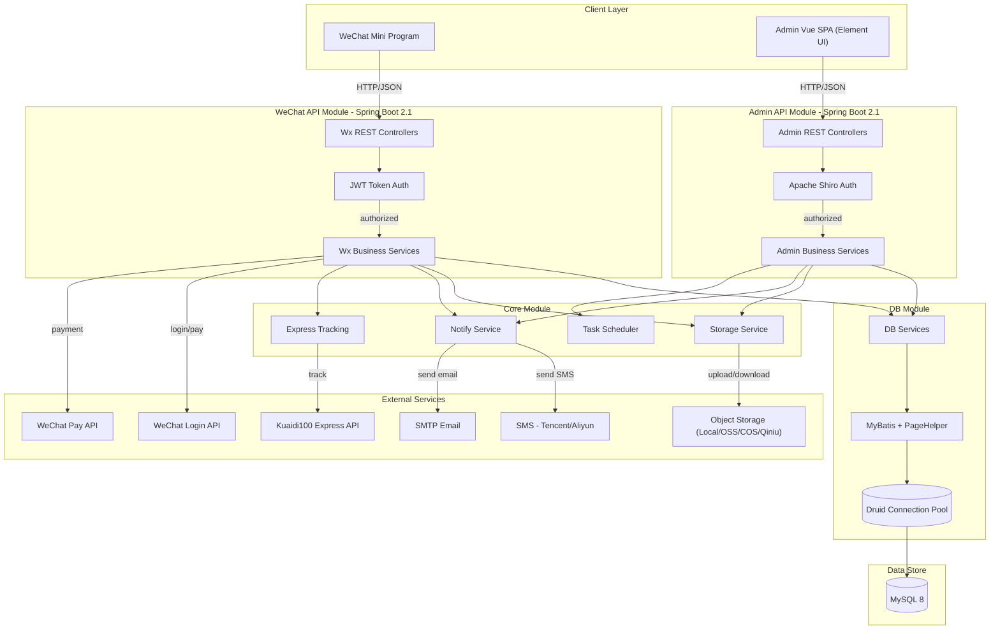
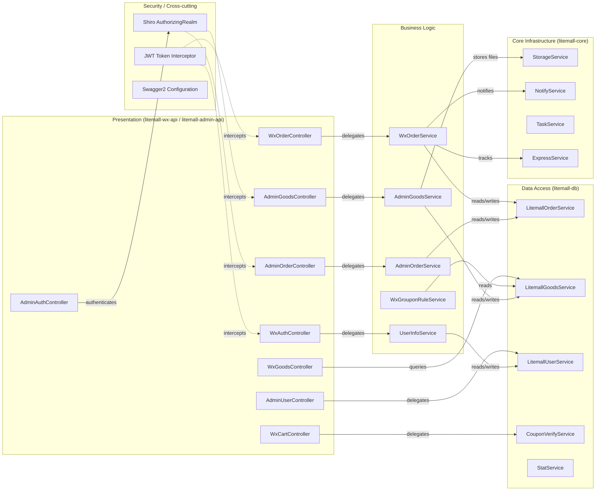

# Architecture Diagram

Litemall is a multi-module Spring Boot e-commerce platform exposing two REST APIs—one for WeChat Mini Program clients and one for an Admin back-office—backed by MySQL via MyBatis and supported by pluggable cloud object storage.

## Application Architecture

### Technology Stack Summary

| Layer | Technology | Version | Purpose |
|---|---|---|---|
| Client – WeChat | WeChat Mini Program | N/A | Mobile storefront |
| Client – Admin | Vue.js + Element UI | 2.x | Back-office management SPA |
| Web Framework | Spring Boot | 2.1.5 | Application container for both APIs |
| Security (Admin) | Apache Shiro | 1.6.0 | Session-based authentication and RBAC |
| Security (WeChat) | java-jwt | 3.4.1 | Stateless JWT token authentication |
| Data Access | MyBatis + PageHelper | 1.3.2 / 1.2.5 | SQL mapping and pagination |
| Connection Pool | Druid | 1.2.1 | High-performance JDBC connection pooling |
| Database | MySQL | 8.0 | Primary relational data store |
| API Docs | Springfox Swagger 2 | 2.9.2 | Auto-generated REST API documentation |
| Messaging (SMS) | QCloud SMS / Aliyun SMS | 1.0.5 / various | Order and verification SMS notifications |
| Object Storage | Local / Aliyun OSS / Tencent COS / Qiniu | Various | Product image and file storage |
| WeChat Integration | weixin-java-miniapp / weixin-java-pay | 4.1.0 | Mini Program login and payment |

### Data Storage & External Services

The sole persistent data store is a MySQL 8 database accessed through a Druid connection pool and MyBatis ORM. No caching tier (Redis/Memcached) is used. Object storage is pluggable: files can be written to the local filesystem or to one of three cloud providers (Aliyun OSS, Tencent COS, or Qiniu). External integrations include WeChat Mini Program login and WeChat Pay for the storefront, Tencent Cloud or Aliyun SMS for customer notifications, SMTP email for back-office notifications, and an optional Kuaidi100 logistics API for shipment tracking.

### Key Architectural Decisions

- **Dual-module REST API design**: The project separates the WeChat Mini Program API (`litemall-wx-api`) from the Admin API (`litemall-admin-api`) into independent Spring Boot deployable units, sharing a common `litemall-db` data access layer and `litemall-core` service layer.
- **MyBatis with generated mappers**: Data access uses MyBatis Generator-produced mapper interfaces and XML, keeping SQL explicit and decoupled from business logic.
- **Pluggable storage and notification backends**: Storage (local vs. cloud OSS) and SMS provider (Tencent vs. Aliyun) are selected via `active` configuration flags, enabling infrastructure switching without code changes.

## Component Relationships

### Component Inventory

| Component | Layer | Type | Responsibility |
|---|---|---|---|
| WxAuthController | Presentation | REST Controller | Handles WeChat Mini Program login, registration, reset |
| WxOrderController | Presentation | REST Controller | Exposes order lifecycle endpoints to WeChat client |
| WxGoodsController | Presentation | REST Controller | Product listing, detail, and search endpoints |
| WxCartController | Presentation | REST Controller | Shopping cart operations |
| WxGrouponController | Presentation | REST Controller | Group-buy activity endpoints |
| AdminOrderController | Presentation | REST Controller | Admin order management and shipment handling |
| AdminGoodsController | Presentation | REST Controller | Admin product CRUD |
| AdminAuthController | Presentation | REST Controller | Admin login with captcha |
| AdminUserController | Presentation | REST Controller | Admin user management |
| WxOrderService | Business Logic | Service | Order creation, payment callback, refund, cancellation |
| WxGrouponRuleService | Business Logic | Service | Group-buy rule lifecycle management |
| AdminOrderService | Business Logic | Service | Admin-side order operations and reporting |
| AdminGoodsService | Business Logic | Service | Admin-side goods/product operations |
| UserInfoService | Business Logic | Service | WeChat user info sync and profile management |
| LitemallOrderService | Data Access | DB Service | CRUD over litemall_order and litemall_order_goods tables |
| LitemallGoodsService | Data Access | DB Service | CRUD and search over goods/product tables |
| LitemallUserService | Data Access | DB Service | CRUD over litemall_user table |
| CouponVerifyService | Data Access | DB Service | Coupon eligibility and redemption logic |
| StatService | Data Access | DB Service | Aggregated statistics queries |
| StorageService | Core Infrastructure | Service | Pluggable file upload/download abstraction |
| NotifyService | Core Infrastructure | Service | Email and SMS notification dispatch |
| TaskService | Core Infrastructure | Service | Scheduled task management (order expiry, etc.) |
| ExpressService | Core Infrastructure | Service | Logistics parcel tracking integration |
| AdminAuthorizingRealm | Security | Shiro Realm | Admin role/permission resolution for Shiro |
| JWT Token Interceptor | Security | Spring Interceptor | WeChat API stateless token validation |
