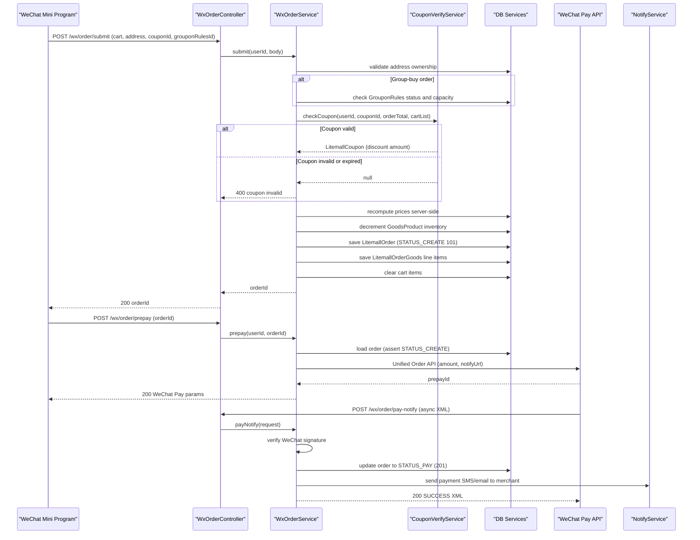

# Core Business Workflows

Litemall is a WeChat Mini Program e-commerce platform where users browse products, manage a shopping cart, place orders with optional group-buy discounts and coupons, pay via WeChat Pay, and track delivery—while an admin back-office manages goods, orders, users, and promotions.

## Domain Entities

| Entity | Service / Bounded Context | Description | Key Relationships |
|---|---|---|---|
| User | Customer Management (wx-api) | Registered WeChat Mini Program shopper | Has Addresses, Cart items, Orders, Collects, Footprints, Search History |
| Address | Customer Management (wx-api) | Saved shipping address | Belongs to User; used when placing an Order |
| Goods | Product Catalog (admin-api / wx-api read) | A product listing with pricing and availability | Belongs to Category and Brand; has GoodsProduct variants, Specifications, Attributes |
| GoodsProduct | Product Catalog | A SKU variant of a Goods item (size/color combination) | Belongs to Goods; maintains inventory number |
| GoodsSpecification | Product Catalog | A specification key-value pair for a Goods item | Belongs to Goods |
| GoodsAttribute | Product Catalog | An extended attribute (e.g., material, origin) | Belongs to Goods |
| Category | Product Catalog (admin-api) | Hierarchical (two-level) product category | Self-referencing parent; contains Goods |
| Brand | Product Catalog (admin-api) | Product brand | Contains Goods |
| Cart | Shopping Cart (wx-api) | A line item in the user's basket | Belongs to User; references Goods and GoodsProduct |
| Order | Order Management (wx-api / admin-api) | A customer purchase order with payment and shipping state | Belongs to User; contains OrderGoods; may have Aftersale, Groupon |
| OrderGoods | Order Management | A line item snapshot within an order | Belongs to Order; references Goods and GoodsProduct |
| Coupon | Promotions (admin-api) | A discount coupon template (fixed/percentage) | Claimed as CouponUser; used in Orders |
| CouponUser | Promotions (wx-api) | A coupon claimed by a specific user | Belongs to User and Coupon; tracks usage status |
| GrouponRules | Group Buy (admin-api) | Group-buy discount rule attached to a Goods item | Drives Groupon instances; has minimum member count and discount amount |
| Groupon | Group Buy (wx-api) | An active or completed group-buy instance | Linked to Order; has creator and participants |
| Aftersale | After-Sale Service (wx-api / admin-api) | A return/refund/exchange request | Belongs to Order and User |
| Admin | Administration (admin-api) | Back-office system user | Has Roles and Permissions |
| Role | Administration (admin-api) | RBAC role for admin users | Has Permissions |
| Permission | Administration (admin-api) | A fine-grained resource-action permission string | Belongs to Role |
| Topic | Content Management (admin-api) | An editorial topic/campaign page | Read by WeChat API |
| Ad | Content Management (admin-api) | Banner advertisement | Read by WeChat API homepage |
| Issue | FAQ Management (admin-api) | Frequently asked question entry | Read by WeChat API |
| Keyword | Search (admin-api) | A search keyword record | Used for search suggestions |
| SearchHistory | Search (wx-api) | A user's search query history | Belongs to User |
| Collect | Wishlist (wx-api) | A wishlist item | Belongs to User; references Goods |
| Footprint | Browsing History (wx-api) | A product view record | Belongs to User; references Goods |
| Feedback | Customer Service (wx-api) | User-submitted feedback | Belongs to User |
| Comment | Product Reviews (wx-api / admin-api) | A product review | Belongs to OrderGoods and User |
| Notice | Notifications (admin-api) | System notice broadcast | Published to NoticeAdmin recipients |
| Storage | File Storage (admin-api / wx-api) | An uploaded file reference (image, etc.) | Used by Goods, Ad, Topic |
| Log | Audit (admin-api) | Admin action audit log entry | |

## Service-to-Domain Mapping

| Service | Domain Context | Owned Entities | External Dependencies |
|---|---|---|---|
| litemall-wx-api | Customer storefront | User, Address, Cart, Order, OrderGoods, Groupon, Aftersale, CouponUser, Collect, Footprint, SearchHistory, Comment, Feedback | WeChat Mini Program Login API; WeChat Pay Unified Order API; litemall-db (in-process) |
| litemall-admin-api | Back-office management | Admin, Role, Permission, Goods, GoodsProduct, Category, Brand, Coupon, GrouponRules, Topic, Ad, Issue, Keyword, Notice, Storage, Log | litemall-db (in-process); optional WeChat mini-app SDK for user data |
| litemall-db | Shared data access | All 34 tables (single shared schema) | MySQL 8 via Druid |
| litemall-core | Cross-cutting infrastructure | System (config key-value store) | Aliyun/Tencent/Qiniu OSS; Tencent/Aliyun SMS; SMTP email; Kuaidi100 express API |

Both `litemall-wx-api` and `litemall-admin-api` share the same database schema with no logical isolation. The wx-api reads admin-managed entities (Goods, Category, Coupon, GrouponRules) and writes to customer entities; the admin-api reads customer entities (User, Order) for management.

## Primary Workflows

### Workflow 1: WeChat Mini Program Login / Registration

1. User opens the Mini Program; the client obtains a short-lived `code` from the WeChat platform.
2. `WxAuthController.loginByWeixin()` receives the code and user profile from the client.
3. The server calls WeChat's `code2session` API to retrieve `openId` and `sessionKey`.
4. The user is looked up by `openId`. If not found, a new `LitemallUser` is created with openId as username and password, and the WeChat nickname/avatar are stored.
5. If found, the existing user's `sessionKey` and `lastLoginTime` are updated.
6. A JWT token is generated from the `userId` and returned to the client for subsequent authenticated requests.

### Workflow 2: Place Order (Submit)

1. User selects items in the cart and proceeds to checkout.
2. `WxOrderService.submit()` validates: user logged in, address exists, cart items are valid.
3. If a group-buy rules ID is supplied: check the rule is active (not expired, not taken down), check participant capacity is not full, check user has not already joined.
4. Coupon eligibility is verified by `CouponVerifyService.checkCoupon()`: checks coupon type, minimum order amount, applicable category/goods restrictions, and that the user's CouponUser record is unused.
5. Price is recomputed server-side from cart items: `goodsPrice + freightPrice - couponDiscount - grouponDiscount - integralDiscount = actualPrice`.
6. Inventory is checked and decremented for each GoodsProduct SKU.
7. A new `LitemallOrder` is persisted in `STATUS_CREATE` (101), with all computed price fields and the snapshot shipping address.
8. `LitemallOrderGoods` line items are saved as order snapshots.
9. Cart items are cleared.
10. If group-buy: a `LitemallGroupon` record is created linking the order to the GrouponRules.
11. The `orderId` is returned to the client.

### Workflow 3: WeChat Pay Payment

1. Client calls `WxOrderService.prepay()` with `orderId`.
2. The order is validated to be in `STATUS_CREATE` and owned by the user.
3. The Unified Order API is called via weixin-java-pay, generating a `prepayId`.
4. The client receives the WeChat Pay JS parameters and presents the payment sheet.
5. After payment, WeChat asynchronously calls `POST /wx/order/pay-notify` (XML).
6. `WxOrderService.payNotify()` validates the WeChat signature, verifies the order amount matches, and updates the order to `STATUS_PAY` (201).
7. `NotifyService` is called to send email or SMS notifications to the merchant.

### Workflow 4: Order Fulfilment (Admin Ship / User Confirm)

1. Admin marks order as shipped via `POST /admin/order/ship` with courier name and tracking number: order moves to `STATUS_SHIP` (301).
2. User confirms receipt via `POST /wx/order/confirm`: order moves to `STATUS_CONFIRM` (401). `OrderGoods.comment` fields are set to `0` (awaiting review).
3. **Auto-confirm** (scheduled, daily at 03:00): `OrderJob.checkOrderUnconfirm()` auto-confirms shipped orders past the `LITEMALL_ORDER_UNCONFIRM`-day threshold → `STATUS_AUTO_CONFIRM` (402).
4. **Comment expiry** (scheduled, daily at 04:00): `OrderJob.checkOrderComment()` closes the comment window for confirmed orders past the `LITEMALL_ORDER_COMMENT`-day threshold by setting `OrderGoods.comment = -1`.

### Workflow 5: Refund / After-Sale

1. User requests refund via `POST /wx/order/refund` (only allowed from `STATUS_PAY`): order moves to `STATUS_REFUND` (202).
2. Admin reviews and either calls `POST /admin/order/refund` (issues WeChat Pay refund, moves to `STATUS_REFUND_CONFIRM` (203) and restores inventory) or `POST /admin/aftersale/recept` / `reject`.
3. For returns after delivery, user submits `POST /wx/aftersale/submit` attaching photos and reason; admin accepts/rejects through `AdminAftersaleController`.

### Workflow 6: Scheduled Maintenance

| Job | Schedule | Action |
|---|---|---|
| `OrderJob.checkOrderUnconfirm` | Daily 03:00 | Auto-confirm shipped orders past the configured threshold |
| `OrderJob.checkOrderComment` | Daily 04:00 | Expire comment eligibility for old confirmed orders |
| `CouponJob.checkCouponExpired` | Every 1 hour | Expire overdue coupons and coupon-user records |
| `DbJob.backup` | Daily 05:00 | Run `mysqldump` and store rotating 7-day backup files |
| `GrouponRuleExpiredTask` (startup runner) | On startup | Mark expired GrouponRules as `STATUS_DOWN_EXPIRE` |

## Cross-Service Data Flows

There are no inter-service HTTP calls. Both API modules access the shared MySQL database in-process through `litemall-db`. The wx-api writes customer data and reads product/promotion data that the admin-api manages. The admin-api reads customer data (users, orders) for reporting.

The only cross-system flows are outbound:
- **WeChat login/pay**: wx-api → WeChat Mini Program API (synchronous)
- **WeChat Pay callback**: WeChat → wx-api (asynchronous HTTP push)
- **Notifications**: core → Tencent/Aliyun SMS or SMTP email (asynchronous fire-and-forget)
- **File storage**: core → Local filesystem / Aliyun OSS / Tencent COS / Qiniu (synchronous upload)
- **Express tracking**: core → Kuaidi100 API (synchronous query)
- **DB backup**: admin-api → local filesystem via `mysqldump` (scheduled)

No circuit breakers are configured for any external call; failures are logged and surface as API errors to the caller.

## Business Workflow Sequence



## Business Rules & Decision Logic

### Order State Machine

```
STATUS_CREATE (101)
  ├─► [user cancel]           → STATUS_CANCEL (102)
  ├─► [auto-cancel job]       → STATUS_AUTO_CANCEL (103)
  ├─► [admin cancel]          → STATUS_ADMIN_CANCEL (104)
  └─► [WeChat Pay callback]   → STATUS_PAY (201)
        ├─► [user refund req]  → STATUS_REFUND (202)
        │     └─► [admin confirm refund] → STATUS_REFUND_CONFIRM (203)
        └─► [admin ships]      → STATUS_SHIP (301)
              └─► [user confirms] → STATUS_CONFIRM (401)
              └─► [auto-confirm]  → STATUS_AUTO_CONFIRM (402)
```

### Order Submission Rules

- Address must belong to the authenticated user.
- All cart items must have valid, in-stock GoodsProduct records.
- Prices are always recomputed server-side; client-supplied prices are ignored.
- Freight price is currently always 0 (free shipping).
- Inventory is decremented atomically at order creation, not at payment.
- A user may not join a group-buy they have already joined, and may not join their own group-buy.
- Group-buy participant count must be less than `discountMember - 1` at time of join.

### Coupon Rules (CouponVerifyService)

- Coupon must exist and be in active status.
- CouponUser record must be in unused status.
- Order total must meet the coupon's minimum purchase amount (`min` field).
- For goods-restricted coupons: at least one item in the cart must belong to the eligible goods or category list.
- Coupon limit field constrains per-user claim count.

### Inventory & Stock Rules

- `LitemallGoodsProduct.number` is the available stock count.
- Stock is decremented on order submit; if the product is out of stock, the submit fails.
- Admin can mark goods as off-sale (`isOnSale = false`), preventing new cart adds.
- Order cancellation restores inventory back to the product.

### Validation Rules

- Input bodies are JSON; mandatory fields (`cartId`, `addressId`, `couponId`) trigger 400 if absent.
- User login is enforced on all mutating wx-api endpoints via JWT interceptor; a 401-equivalent is returned if the token is invalid or absent.
- Admin endpoints enforce Apache Shiro `authc` filter (session-based); `@RequiresPermissions` annotations enforce RBAC on individual operations.

### Transaction Boundaries

- `@Transactional` is applied to the order submit method; inventory decrement, order save, and cart clear are atomic.
- Optimistic locking (`updateWithOptimisticLocker`) guards concurrent order status updates using the `updateTime` timestamp as a version field.
- The WeChat Pay notify handler is idempotent by design (checks existing order status before updating).

### Scheduled Business Logic

- **Order auto-cancel**: Unpaid orders older than `LITEMALL_ORDER_UNPAID` minutes are cancelled; inventory is restored.
- **Order auto-confirm**: Shipped orders with no user confirmation after `LITEMALL_ORDER_UNCONFIRM` days are automatically confirmed.
- **Comment expiry**: Confirmed orders older than `LITEMALL_ORDER_COMMENT` days lose their commentable status.
- **Coupon expiry**: Coupons past their time window are expired hourly; associated CouponUser records are also expired.
- **DB backup**: Daily mysqldump with 7-day rolling retention.

### Audit & Logging

The `LitemallLog` entity records every admin API call with the admin username, IP address, request type, and action description. No equivalent audit trail exists for customer (WeChat) operations.
