# Data Architecture & Persistence Layer

Litemall uses a single shared MySQL 8 database with 34 tables, accessed through MyBatis-generated mappers (no JPA/Hibernate), with all entity classes produced by MyBatis Generator from the canonical `litemall_table.sql` schema.

## Database Configuration

| Service/Module | DB Type | Profile | Driver | Connection | Migration Tool |
|---|---|---|---|---|---|
| litemall-db | MySQL 8 | all (single profile) | mysql-connector-java 8.0.28 | localhost:3306/litemall via Druid pool (max-active=50, min-idle=10, max-wait=60s) | None — schema managed manually via `litemall_table.sql`; seed data loaded from `litemall_data.sql` |

No Flyway, Liquibase, or other migration tool is configured. DDL changes are applied manually. The SQL scripts (`litemall_table.sql`, `litemall_data.sql`) in `litemall-db/sql/` are the authoritative schema definition. No environment-specific profiles switch to an alternate database (e.g., no in-memory H2/HSQLDB for testing). See `configuration-inventory.md` for the full property inventory.

## Data Ownership per Service

| Service | Tables Owned | ORM Framework | Caching | Notes |
|---|---|---|---|---|
| litemall-db (shared) | All 34 tables (see Entity Model) | MyBatis 1.3.2 with MyBatis Generator | None | Single shared database; no schema-per-service separation |
| litemall-wx-api | Reads/writes: user, cart, order, order_goods, address, goods, coupon_user, groupon, aftersale, collect, footprint, search_history, comment, feedback | Via litemall-db | None | WeChat-facing; writes to customer-domain tables |
| litemall-admin-api | Reads/writes: admin, role, permission, goods, category, brand, topic, ad, coupon, order, aftersale, notice, notice_admin, log, storage, keyword, issue, region, system | Via litemall-db | None | Admin back-office; also reads customer tables for management |
| litemall-core | Reads: system (config), storage | Via litemall-db | None | Infrastructure services; no exclusive table ownership |

## Entity Model

```mermaid
erDiagram
    LitemallUser ||--o{ LitemallAddress : "has"
    LitemallUser ||--o{ LitemallCart : "has"
    LitemallUser ||--o{ LitemallOrder : "places"
    LitemallUser ||--o{ LitemallCollect : "collects"
    LitemallUser ||--o{ LitemallFootprint : "browses"
    LitemallUser ||--o{ LitemallSearchHistory : "searches"
    LitemallUser ||--o{ LitemallFeedback : "submits"
    LitemallOrder ||--o{ LitemallOrderGoods : "contains"
    LitemallOrder ||--o{ LitemallGroupon : "participates in"
    LitemallOrder ||--o{ LitemallAftersale : "has"
    LitemallGoods ||--o{ LitemallGoodsProduct : "has variants"
    LitemallGoods ||--o{ LitemallGoodsSpecification : "has specs"
    LitemallGoods ||--o{ LitemallGoodsAttribute : "has attributes"
    LitemallGoods ||--o{ LitemallGrouponRules : "governed by"
    LitemallGoods ||--o{ LitemallCart : "added to"
    LitemallGoods ||--o{ LitemallCollect : "collected as"
    LitemallGoods ||--o{ LitemallComment : "receives"
    LitemallCategory ||--o{ LitemallGoods : "contains"
    LitemallCategory |o--o{ LitemallCategory : "parent of"
    LitemallBrand ||--o{ LitemallGoods : "brands"
    LitemallCoupon ||--o{ LitemallCouponUser : "claimed by"
    LitemallGrouponRules ||--o{ LitemallGroupon : "drives"
    LitemallRole ||--o{ LitemallPermission : "grants"
    LitemallAdmin }o--o{ LitemallRole : "has"

    LitemallUser {
        int id PK
        string username
        string password
        string mobile
        string weixinOpenid
        string nickname
        string avatar
        byte gender
        byte userLevel
        byte status
        boolean deleted
    }
    LitemallOrder {
        int id PK
        int userId FK
        string orderSn
        short orderStatus
        short aftersaleStatus
        string consignee
        string mobile
        string address
        decimal actualPrice
        string payId
        datetime payTime
        string shipSn
        string shipChannel
        boolean deleted
    }
    LitemallOrderGoods {
        int id PK
        int orderId FK
        int goodsId FK
        int productId FK
        string goodsName
        short number
        decimal price
        boolean deleted
    }
    LitemallGoods {
        int id PK
        string goodsSn
        string name
        int categoryId FK
        int brandId FK
        decimal retailPrice
        boolean isOnSale
        boolean isNew
        boolean isHot
        boolean deleted
    }
    LitemallGoodsProduct {
        int id PK
        int goodsId FK
        decimal price
        int number
        boolean deleted
    }
    LitemallCart {
        int id PK
        int userId FK
        int goodsId FK
        int productId FK
        short number
        decimal price
        boolean checked
    }
    LitemallAddress {
        int id PK
        int userId FK
        string name
        string tel
        string province
        string city
        string county
        string addressDetail
        boolean isDefault
    }
    LitemallCategory {
        int id PK
        int pid FK
        string name
        string level
        byte sortOrder
    }
    LitemallBrand {
        int id PK
        string name
        decimal floorPrice
        boolean deleted
    }
    LitemallCoupon {
        int id PK
        string name
        short type
        decimal discount
        decimal min
        short total
        short status
        boolean deleted
    }
    LitemallCouponUser {
        int id PK
        int couponId FK
        int userId FK
        short status
        datetime usedTime
    }
    LitemallGrouponRules {
        int id PK
        int goodsId FK
        decimal discount
        int discountMember
        datetime expireTime
        short status
    }
    LitemallGroupon {
        int id PK
        int orderId FK
        int rulesId FK
        int userId FK
        int creatorUserId
        short status
    }
    LitemallAftersale {
        int id PK
        int orderId FK
        int userId FK
        short type
        short status
        decimal amount
        boolean deleted
    }
    LitemallAdmin {
        int id PK
        string username
        string password
        datetime lastLoginTime
        boolean deleted
    }
    LitemallRole {
        int id PK
        string name
        boolean enabled
        boolean deleted
    }
    LitemallPermission {
        int id PK
        int roleId FK
        string permission
        boolean deleted
    }
    LitemallStorage {
        int id PK
        string key
        string name
        string type
        int size
        string url
        boolean deleted
    }
```

## Key Repository Methods

| Service | Mapper / Service | Notable Methods | Purpose |
|---|---|---|---|
| litemall-db | LitemallGoodsService | `queryByHot(offset, limit)`, `queryByNew(offset, limit)` | Paginated hot/new goods for storefront home |
| litemall-db | LitemallGoodsService | `querySelective(catId, brandId, keywords, isHot, isNew, offset, limit, sort, order)` | Full-text + filter search for goods listing |
| litemall-db | LitemallGoodsService | `queryByIds(Integer[] ids)` | Batch goods lookup by ID array |
| litemall-db | LitemallGoodsService | `getCatIds(brandId, keywords, isHot, isNew)` | Resolve category IDs matching filter criteria |
| litemall-db | LitemallOrderService | `queryUnpaid(int minutes)` | Find orders unpaid beyond timeout (for auto-cancel scheduler) |
| litemall-db | LitemallOrderService | `queryUnconfirm(int days)` | Find orders unconfirmed beyond days (for auto-confirm scheduler) |
| litemall-db | LitemallOrderService | `queryComment(int days)` | Find orders eligible for comment reminder |
| litemall-db | LitemallOrderService | `updateWithOptimisticLocker(order)` | Optimistic-locking update to prevent concurrent status conflicts |
| litemall-db | LitemallOrderService | `queryVoSelective(...)` | Admin order list with joined user nickname and consignee |
| litemall-db | LitemallUserService | `queryByOid(String openId)` | WeChat Mini Program login lookup by openid |
| litemall-db | LitemallUserService | `queryByMobile(String mobile)` | SMS captcha / registration duplicate check |
| litemall-db | CouponVerifyService | `checkCoupon(userId, couponId, goodsTotalPrice, goodsIds, categoryIds)` | Eligibility check for coupon redemption at checkout |
| litemall-db | StatMapper | `statUser()`, `statOrder()`, `statGoods()` | Raw SQL aggregation queries for admin dashboard charts |
| litemall-db | OrderMapper | `getOrderList(query, orderByClause)` | Dynamic admin order list with joined VO projection |
| litemall-db | OrderMapper | `updateWithOptimisticLocker(lastUpdateTime, order)` | Optimistic-lock order update with timestamp guard |

## Caching Strategy

No caching layer is implemented. There is no Redis, EhCache, Caffeine, or Spring `@Cacheable` usage anywhere in the codebase. All reads go directly to MySQL via the Druid connection pool. The only "cache" endpoint in the application is `GET /wx/home/cache`, which clears an in-memory `ConcurrentHashMap` used to throttle duplicate WeChat Pay callbacks — this is not a data cache.

**Implications for modernization:** Frequently read, rarely changing data (product catalog, categories, brands, active coupon list) is queried from MySQL on every request. For any production-scale deployment, a distributed cache (e.g., Redis) should be introduced for these hot read paths.

## Data Ownership Boundaries

All 34 tables reside in a single shared MySQL schema (`litemall`). There is no logical or physical separation between the WeChat storefront domain and the Admin back-office domain. Both `litemall-wx-api` and `litemall-admin-api` access the same database through the shared `litemall-db` module, which provides a unified service/mapper layer.

**Cross-service data access** is entirely in-process: `litemall-wx-api` and `litemall-admin-api` each depend on `litemall-db` as a compile-time Maven module, not as a remote service. There is no REST-to-REST data access between the two API modules.

**Read/Write pattern:** Both APIs are mixed read/write. There is no CQRS separation. The admin API reads customer tables (users, orders) for management and writes to configuration tables (system, coupon, category) that the WeChat API reads back. This tight coupling means any schema change to a shared table affects both APIs simultaneously.

### Data Classification & Sensitivity

| Entity | Sensitive Fields | Classification | Controls in Place |
|---|---|---|---|
| LitemallUser | username, password (BCrypt hashed), mobile, weixinOpenid, sessionKey, nickname, avatar, birthday, lastLoginIp | PII | Password is BCrypt-hashed. `sessionKey` (WeChat session key) stored in plaintext. No encryption-at-rest for mobile, openid, or IP fields. |
| LitemallAddress | name, tel, province, city, county, addressDetail, postalCode | PII | No encryption-at-rest or masking. Plaintext shipping address stored directly. |
| LitemallOrder | consignee, mobile, address, payId, refundContent | PII + PCI-adjacent | No encryption-at-rest. Payment transaction IDs and refund details stored in plaintext. No PCI-DSS scope since WeChat Pay handles card data externally, but order-level PII is unprotected. |
| LitemallAdmin | username, password (BCrypt hashed), lastLoginIp | PII | Password is BCrypt-hashed. No MFA or session encryption beyond Shiro defaults. |
| LitemallFeedback | content, mobile, feedType | PII | User-submitted feedback with mobile number stored in plaintext. |
| LitemallLog | admin, ip, type, action | PII-adjacent | Admin action audit log; IP and username stored in plaintext, no tamper protection. |

**Summary:** Customer PII (names, phone numbers, shipping addresses) is stored in plaintext with no field-level encryption, data masking, or access-control annotations. Passwords are BCrypt-hashed, which is correct. The WeChat `sessionKey` field in `LitemallUser` is stored in plaintext despite being a sensitive credential that should not be persisted. No audit trail exists for customer data access or modifications.
