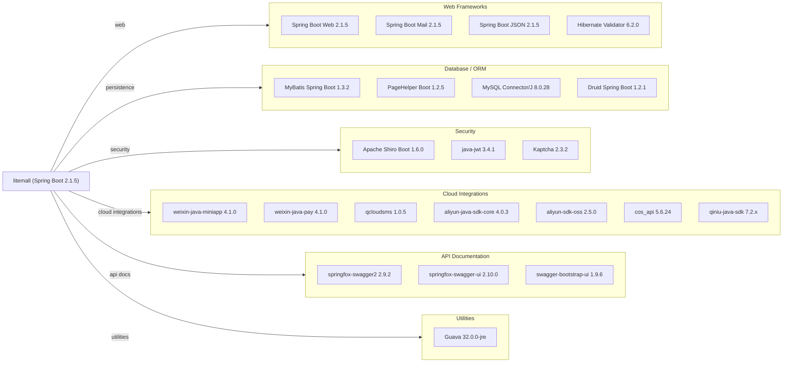

# Dependency Map

Litemall is a multi-module Maven Spring Boot e-commerce platform with 20+ declared external dependencies managed centrally through the parent POM, spanning web frameworks, data access, security, cloud integrations, and API documentation.

## Dependencies

### Dependency Summary

| Category | Count | Key Libraries | Notes |
|---|---|---|---|
| Web Frameworks | 4 | Spring Boot Web 2.1.5, Spring Boot Mail 2.1.5, Hibernate Validator 6.2.0 | Spring Boot 2.1.x is end-of-life |
| Database / ORM | 4 | MyBatis Spring Boot 1.3.2, MySQL Connector/J 8.0.28, Druid 1.2.1 | No caching layer; MyBatis with code-gen mappers |
| Security | 3 | Apache Shiro 1.6.0, java-jwt 3.4.1, Kaptcha 2.3.2 | Dual security model: Shiro for Admin, JWT for WeChat API |
| Cloud Integrations | 7 | weixin-java 4.1.0, qcloudsms 1.0.5, Aliyun/Tencent/Qiniu SDKs | Multiple pluggable storage and SMS SDKs |
| API Documentation | 3 | Springfox Swagger2 2.9.2, swagger-bootstrap-ui 1.9.6 | Springfox is abandoned; incompatible with Spring Boot 2.6+ |
| Utilities | 1 | Guava 32.0.0-jre | |

### Version & Compatibility Risks

Spring Boot 2.1.5 reached end-of-life in November 2019 and carries numerous known CVEs; upgrading to Spring Boot 3.x would require Java 17+ and Jakarta EE namespace migration. Springfox Swagger2 (2.9.2) is effectively abandoned and breaks with Spring Boot 2.6+ due to a circular dependency issue in Spring MVC; the replacement is Springdoc OpenAPI. Apache Shiro 1.6.0 is several major versions behind the current 2.x line, which introduced a breaking package restructure. `java-jwt 3.4.1` is a very old release of the Auth0 JWT library (current is 4.x). MyBatis Spring Boot Starter 1.3.2 is similarly dated; the 3.x series is the current maintained line. The Aliyun OSS SDK 2.5.0 and Tencent COS SDK 5.6.24 may not support the latest regional endpoint features. `qcloudsms 1.0.5` is a legacy Tencent Cloud SDK that has been superseded by the unified `tencentcloud-sdk-java`.

### Notable Observations

- **Duplicate SMS provider SDKs**: Both Tencent (`qcloudsms`) and Aliyun SMS SDKs are bundled at runtime even though only one is active at a time; the inactive one adds unnecessary classpath bloat and potential CVE exposure.
- **Three object storage SDKs in core**: Aliyun OSS, Tencent COS, and Qiniu SDK are all present simultaneously; extracting them into optional Spring Boot auto-configurations or separate modules would reduce the artifact size.
- **No caching dependency**: There is no Redis, EhCache, or Caffeine dependency declared anywhere, meaning session data, product catalog, and hot query results are not cached—a potential scalability bottleneck in production.
- **Springfox vs. Springdoc**: Using both `springfox-swagger2` and `swagger-bootstrap-ui` (a Springfox UI replacement) is inconsistent; migrating to Springdoc OpenAPI would consolidate API documentation under a single actively maintained library.

## Test Dependencies

| Framework | Version | Notes |
|---|---|---|
| Spring Boot Starter Test | 2.1.5.RELEASE | Includes JUnit 4/5, AssertJ, Mockito via spring-boot-starter-test |
| PowerMock API Mockito | 1.6.6 | Legacy PowerMock; incompatible with Mockito 2+ and JUnit 5 |
| PowerMock Module JUnit4 | 1.6.6 | Requires JUnit 4; blocks migration to JUnit 5 |
| Mockito Core | 1.10.19 | Very old Mockito version; current is 5.x |

Total test-scope dependencies: 4

The test stack is heavily outdated: PowerMock 1.6.6 paired with Mockito 1.10.19 is incompatible with modern JUnit 5 and Mockito 4+/5+. There are no integration test frameworks (Testcontainers, etc.) or contract-testing libraries, meaning database-level and API-contract tests would need to be added as part of any modernization effort.
