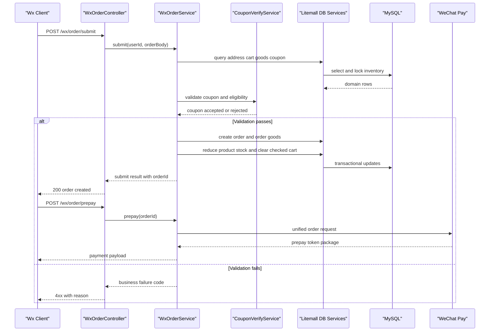

# API & Service Communication Contracts

The codebase exposes a broad REST API surface through separate admin and wx API modules, with synchronous in-process service interactions and external synchronous payment or notification calls.

## Service Catalog

| Service | Port | Category | Purpose |
|---|---:|---|---|
| litemall-admin-api | 8083 | API Layer | Back-office management APIs for catalog, users, orders, promotion, and configuration |
| litemall-wx-api | 8082 | API Layer | Customer-facing APIs for auth, catalog browsing, cart, order lifecycle, and aftersale |
| litemall-core | inherited in host app | Business | Shared notification, payment client, storage, express, and utility components |
| litemall-db | inherited in host app | Business | Shared MyBatis-based persistence services and mapper layer |
| litemall-all | 8080 | Infrastructure | Monolithic assembly and runtime host for admin and wx modules |

## API Endpoints Inventory

| Service | Method | Path | Request Type | Response Type |
|---|---|---|---|---|
| litemall-wx-api (WxAuthController) | POST | `/wx/auth/login`, `/wx/auth/register`, `/wx/auth/login_by_weixin` | JSON body parsed from raw string | JSON object with token and user profile |
| litemall-wx-api (WxGoodsController) | GET | `/wx/goods/list`, `/wx/goods/detail`, `/wx/goods/related` | Query params (`category`, `keyword`, `goodsId`) | JSON object with goods lists and detail payloads |
| litemall-wx-api (WxCartController) | GET/POST | `/wx/cart/index`, `/wx/cart/add`, `/wx/cart/update`, `/wx/cart/checkout` | JSON body for mutations; query for reads | JSON cart aggregate and operation status |
| litemall-wx-api (WxOrderController) | POST/GET | `/wx/order/submit`, `/wx/order/prepay`, `/wx/order/pay-notify`, `/wx/order/refund`, `/wx/order/confirm`, `/wx/order/list` | JSON body for lifecycle actions; query for list | JSON order summary, payment payload, or state result |
| litemall-wx-api (WxStorageController) | POST/GET | `/wx/storage/upload`, `/wx/storage/fetch/{key:.+}` | Multipart upload or path parameter | JSON metadata or binary stream |
| litemall-admin-api (AdminAuthController) | GET/POST | `/admin/auth/kaptcha`, `/admin/auth/login`, `/admin/auth/logout`, `/admin/auth/info` | Login JSON body, session cookie | JSON auth profile and permission payload |
| litemall-admin-api (AdminGoodsController) | GET/POST | `/admin/goods/list`, `/admin/goods/create`, `/admin/goods/update`, `/admin/goods/delete` | JSON body for create or update | JSON entity payload and operation status |
| litemall-admin-api (AdminOrderController) | GET/POST | `/admin/order/list`, `/admin/order/detail`, `/admin/order/refund`, `/admin/order/ship`, `/admin/order/pay` | Query filters and JSON command body | JSON order data and command result |
| litemall-admin-api (AdminConfigController) | GET/POST | `/admin/config/mall`, `/admin/config/express`, `/admin/config/order`, `/admin/config/wx`, `/admin/config/storage` | JSON config sections | JSON persisted config values |
| litemall-admin-api (AdminRoleController) | GET/POST | `/admin/role/list`, `/admin/role/create`, `/admin/role/update`, `/admin/role/permissions` | JSON role and permission assignments | JSON role and permission data |

API versioning scheme: endpoints are grouped by path prefix (`/admin/*` and `/wx/*`) without explicit URI version segments.

## Management & Observability Endpoints

| Service | Endpoint | Custom Metrics (if any) |
|---|---|---|
| litemall-admin-api | `/swagger-ui.html` and Swagger bootstrap UI routes | None detected in source |
| litemall-wx-api | `/swagger-ui.html` and Swagger bootstrap UI routes | None detected in source |
| litemall-all | Logback output and scheduled order jobs | No explicit Micrometer or Actuator endpoints detected |

## DTOs & Contracts

The API commonly uses raw JSON bodies parsed with `JacksonUtil` in controllers and services, with domain objects such as `LitemallOrder`, `LitemallCart`, `LitemallAddress`, `LitemallCoupon`, and `LitemallAftersale` serving as service-level request or response contracts. `OrderVo` and `UserVo` in `litemall-db` provide composite response models for admin order views and user identity views. Gateway-level DTO aggregation is implemented as assembled maps returned from service methods such as `WxOrderService` and `AdminOrderService`, rather than dedicated immutable DTO classes. Serialization is Jackson-based via Spring Boot JSON starter. Swagger documentation is annotation-driven (`@EnableSwagger2`) and there are no protobuf or GraphQL schemas.

## Communication Patterns

Communication is primarily synchronous and in-process: controllers delegate to service classes, which call `litemall-db` services and MyBatis mappers against a shared database. External synchronous calls are used for WeChat payment (prepay, notify, refund), SMS template notifications, and object storage provider APIs. Asynchronous communication is limited to scheduled jobs and executor-based parallel fetches inside selected wx handlers, with no message queue usage detected. Circuit-breaker or retry frameworks are not present; failure handling relies on direct error responses and transactional rollback in key operations (`@Transactional` on order submit and refund flows). Startup availability is tied to MySQL readiness for the assembled runtime service. Security posture: admin APIs are guarded by Shiro auth chain on `/admin/**`, wx APIs use login token flow and authorization interceptors, and transport-level TLS termination is expected externally (no in-app HTTPS server config found).

## Service Technology Matrix

| Service | Web | Data Access | Discovery | Gateway | Actuator | Cache | Metrics |
|---|---|---|---|---|---|---|---|
| litemall-admin-api | Spring MVC | Uses `litemall-db` services | None | No | No | Minimal | No explicit exporter |
| litemall-wx-api | Spring MVC | Uses `litemall-db` services | None | No | No | In-memory home and catalog cache helper | No explicit exporter |
| litemall-core | Spring Beans | Indirect through db module | None | No | No | None | No explicit exporter |
| litemall-db | N/A | MyBatis mappers and services | None | No | No | None | No explicit exporter |
| litemall-all | Spring Boot host | Composition of modules | None | No | No | Inherited from modules | No explicit exporter |

## Service Communication Sequence

