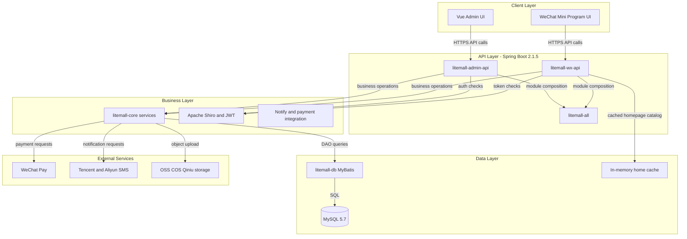
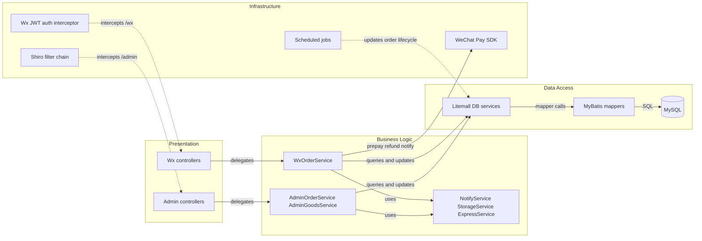

# Architecture Diagram

This repository is a multi-module Spring Boot e-commerce system with separate admin and customer API modules over a shared data and core service layer.

## Application Architecture

### Technology Stack Summary

| Layer | Technology | Version | Purpose |
|---|---|---|---|
| Presentation | Vue (litemall-admin), WeChat Mini Program (litemall-wx) | repo-managed | Admin and customer front-end clients |
| API | Spring Boot | 2.1.5.RELEASE | REST API endpoints for admin and customer channels |
| Security | Apache Shiro, java-jwt | 1.6.0, 3.4.1 | Session-based admin auth and token-based customer auth |
| Business | Spring components in litemall-core | Spring Boot managed | Order, payment, notify, storage orchestration |
| Data Access | MyBatis, PageHelper, Druid | 1.3.2, 1.2.5, 1.2.1 | Data access, paging, connection pooling |
| Data Storage | MySQL | 5.7 in docker-compose | Primary relational data store |

### Data Storage & External Services

The application persists business entities in a shared MySQL database through MyBatis mapper/service classes in `litemall-db`. It integrates with external payment, SMS, and object-storage providers through `litemall-core`, and uses a lightweight in-process cache for selected wx homepage and catalog payloads.

### Key Architectural Decisions

- Uses a multi-module monolith where admin and wx APIs are separately packaged but share common core and db modules.
- Keeps data access centralized in `litemall-db` service wrappers over generated MyBatis mappers.
- Applies channel-specific authentication strategies: Shiro session/auth filters for admin endpoints and JWT-based login flow for wx endpoints.

## Component Relationships

### Component Inventory

| Component | Layer | Type | Responsibility |
|---|---|---|---|
| AdminOrderController | Presentation | REST Controller | Admin operations for order query, refund, ship, pay, delete |
| WxOrderController | Presentation | REST Controller | Customer order submission, payment, cancellation, refund, confirm |
| AdminOrderService | Business Logic | Service | Enforces admin-side order state transitions and side effects |
| WxOrderService | Business Logic | Service | Runs transactional customer checkout and payment flow |
| NotifyService | Business Logic | Service | Sends SMS and mail notifications for order events |
| LitemallOrderService | Data Access | Service | Order persistence queries plus optimistic locking updates |
| LitemallOrderMapper / OrderMapper | Data Access | MyBatis Mapper | CRUD and custom SQL projections over order tables |
| ShiroConfig | Infrastructure | Security Config | Declares admin filter chain and authorization setup |
| OrderJob | Infrastructure | Scheduled Job | Periodically auto-confirms and comment-expires orders |
| WxConfig | Infrastructure | Integration Config | Wires WeChat miniapp and payment SDK clients |
