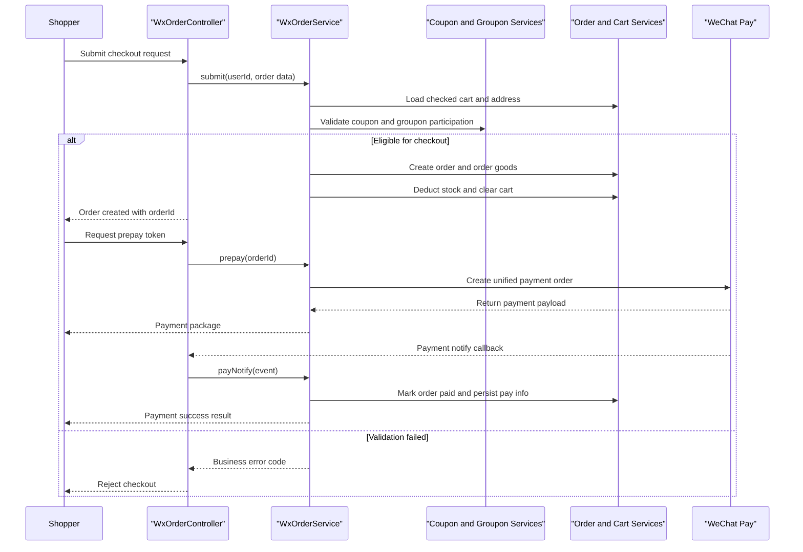

# Core Business Workflows

The application implements end-to-end e-commerce workflows for customer ordering and admin fulfillment, including payment, refund, shipment, coupon, and aftersale handling.

## Domain Entities

| Entity | Service / Bounded Context | Description | Key Relationships |
|---|---|---|---|
| User | Customer Identity | Shopper account and login identity | Owns addresses, carts, orders, coupons |
| Goods | Catalog Management | Product information and sale flags | Linked to category, brand, products, attributes |
| Cart | Shopping Context | User-selected goods before checkout | Ties user to goods and product SKU |
| Order | Order Management | Commercial transaction lifecycle aggregate | Contains order-goods rows and aftersale state |
| OrderGoods | Fulfillment | Line items and quantity snapshot | Child of order; references goods and product |
| Coupon / CouponUser | Promotion | Discount policy and user assignment | Applied during submit and refunded on rollback |
| Aftersale | Post-order Support | Return or aftersale request state | Attached to a completed order |
| Groupon / GrouponRules | Promotion Campaign | Group-buy activity and participation | Influences checkout eligibility and pricing |

## Service-to-Domain Mapping

| Service | Domain Context | Owned Entities | External Dependencies |
|---|---|---|---|
| litemall-wx-api | Customer Commerce | Order, Cart, Coupon usage, Aftersale initiation | WeChat Pay, notification services, shared db services |
| litemall-admin-api | Operations and Fulfillment | Order fulfillment, refund confirmation, config, role management | WeChat refund API, notification services, shared db services |
| litemall-db | Persistence Context | All platform entities and state transitions | MySQL |
| litemall-core | Integration Context | Notification, storage, express, payment client wiring | SMS vendors, object storage vendors, WeChat APIs |

## Primary Workflows

### Workflow 1: Customer checkout and payment

Entry point is `POST /wx/order/submit`, followed by payment endpoints (`/wx/order/prepay` or `/wx/order/h5pay`). The flow validates address, cart contents, coupon eligibility, and optional groupon constraints, then creates order records, decrements inventory, and clears checked cart items in a transaction. Payment callbacks from `/wx/order/pay-notify` transition orders from created to paid and trigger notification side effects.

### Workflow 2: Admin refund and fulfillment

Admin operators use `/admin/order/refund`, `/admin/order/ship`, and `/admin/order/pay` to advance order fulfillment. Refund validates current order status and amount, calls external payment refund, updates order and stock, reverts coupon assignments, and notifies users. Shipping transitions paid orders to shipped state and emits shipment notifications.

### Workflow 3: Scheduled order lifecycle maintenance

Background jobs (`OrderJob`) run on schedules to auto-confirm long-unreceived shipped orders and expire commentable windows after configured day thresholds. This keeps order lifecycle moving even without manual user action.

## Cross-Service Data Flows

The application uses in-process module composition rather than networked microservice calls. wx and admin APIs both orchestrate `litemall-db` services and shared domain entities from one database. Checkout flow joins address, cart, coupon, goods, and groupon data before creating the order aggregate. On failure (invalid coupon, expired groupon, insufficient stock, payment exception), the operation returns business errors and transactional updates are rolled back. For read-heavy homepage and catalog paths, wx controllers can return cached aggregate payloads when enabled.

## Business Workflow Sequence

## Business Rules & Decision Logic

- Checkout requires authenticated user, valid address, non-empty checked cart, and valid coupon or groupon references.
- Groupon rules enforce campaign state, participant count limits, and anti-self-join conditions before order creation.
- Order lifecycle uses explicit status transitions (`create`, `pay`, `ship`, `confirm`, `refund`, `auto-confirm`) checked before each command.
- Refund flow enforces actual-price consistency and current refund state before invoking external payment reversal.
- Core order mutation paths are transactional (`@Transactional`), so stock, coupons, and order rows stay consistent on failures.
- Scheduled rules automatically confirm stale shipped orders and expire pending comment windows based on configured day thresholds.
