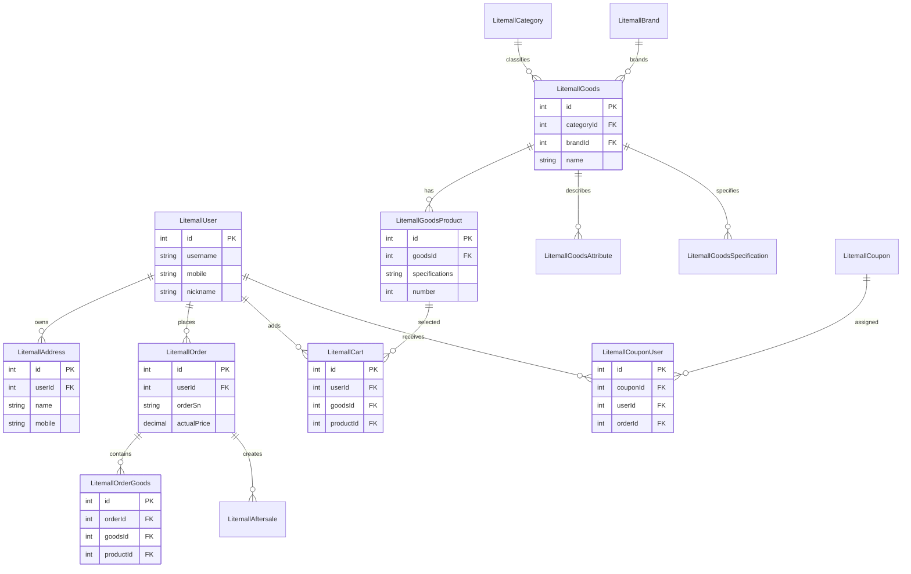

# Data Architecture & Persistence Layer

The application uses a shared relational data layer centered on MySQL with MyBatis mapper and service abstractions, covering roughly 34 domain entities in `litemall-db`.

## Database Configuration

| Service or Module | DB Type | Profile | Driver | Connection | Migration Tool |
|---|---|---|---|---|---|
| litemall-db | MySQL | `db` | `com.mysql.cj.jdbc.Driver` | JDBC URL to `localhost:3306/litemall` via Druid pool | SQL scripts under `litemall-db/sql` |
| litemall-admin-api | MySQL via shared db module | `db,core,admin` | inherited from db module | Uses shared `litemall-db` datasource wiring | None detected |
| litemall-wx-api | MySQL via shared db module | `db,core,wx` | inherited from db module | Uses shared `litemall-db` datasource wiring | None detected |
| docker deployment | MySQL 5.7 container | docker-compose | mysql image builtin driver | Internal compose network plus `3306` mapping | Init scripts mounted at `/docker-entrypoint-initdb.d` |

## Data Ownership per Service

| Service | Tables Owned | ORM Framework | Caching | Notes |
|---|---|---|---|---|
| litemall-db | All core business tables (`litemall_order`, `litemall_goods`, `litemall_user`, `litemall_cart`, etc.) | MyBatis with generated mappers | None at persistence layer | Central ownership of schema and mapper classes |
| litemall-wx-api | No separate tables; orchestrates shared tables through db services | Delegates to `litemall-db` services | Home and catalog in-process cache helper | Customer workflows consume shared order and catalog data |
| litemall-admin-api | No separate tables; operates shared tables through db services | Delegates to `litemall-db` services | None specific | Admin workflows manage same records |
| litemall-core | No direct table ownership | Service utilities | None | Integrates external payment, notify, and storage |

## Entity Model

## Key Repository Methods

| Service | Repository | Notable Methods | Purpose |
|---|---|---|---|
| litemall-db | `LitemallOrderService` (`LitemallOrderMapper`, `OrderMapper`) | `updateWithOptimisticLocker`, `queryUnpaid`, `queryUnconfirm`, `queryVoSelective` | Maintains order lifecycle transitions and custom admin reporting queries |
| litemall-db | `LitemallCartService` (`LitemallCartMapper`) | `queryExist`, `queryByUidAndChecked`, `updateCheck`, `updateProduct` | Supports checkout cart validation and batch state updates |
| litemall-db | `LitemallGoodsService` (`LitemallGoodsMapper`) | `querySelective`, `queryByHot`, `queryByNew`, `getCatIds` | Provides catalog filtering and home-page product projections |
| litemall-db | `LitemallCouponService` (`LitemallCouponMapper`) | `queryAvailableList`, `findByCode`, `queryExpired` | Coupon eligibility and lifecycle operations |
| litemall-db | `LitemallUserService` (`LitemallUserMapper`) | `queryByUsername`, `queryByMobile`, `queryByOpenid` | Identity lookups for login and registration constraints |

## Caching Strategy

| Area | Provider | Pattern | TTL or Expiry | Notes |
|---|---|---|---|---|
| wx home and catalog API responses | In-process `ConcurrentHashMap` (`HomeCacheManager`) | Cache-aside | 10 minutes when enabled | Controlled by static `ENABLE` flag (default false) |
| Database entities and queries | None explicit | Direct query per request | N/A | No Redis, EhCache, or second-level ORM cache detected |

## Data Ownership Boundaries

The system uses a shared database model where both admin and wx modules read and mutate the same tables through the `litemall-db` service layer. Cross-module data access is in-process service invocation instead of REST between modules, and there is no database-per-service isolation or CQRS split. Write-heavy order workflows are wrapped in transactions in API service methods, while reporting and list endpoints are mostly read-only query paths.

### Data Classification & Sensitivity

| Entity | Sensitive Fields | Classification | Controls in Place |
|---|---|---|---|
| `LitemallUser` | mobile, nickname, avatar | PII | Application-level auth checks; no explicit field encryption or masking in model layer |
| `LitemallAddress` | name, mobile, detailedAddress | PII | Access tied to userId in service queries; no explicit masking or encryption-at-rest config found |
| `LitemallOrder` | consignee, mobile, address, order amounts | PII | Business auth and order ownership checks; no explicit field-level cryptography detected |
| `LitemallAdmin` | username, password hash | Sensitive credentials | Password hashing exists in auth flows; no dedicated secrets vault integration in persistence code |
| `LitemallCouponUser` | user linkage and order linkage | Internal | Standard row-level linkage only |

No PHI or PCI data model with card-number storage was detected in entity classes; payment processing is delegated to external providers.
