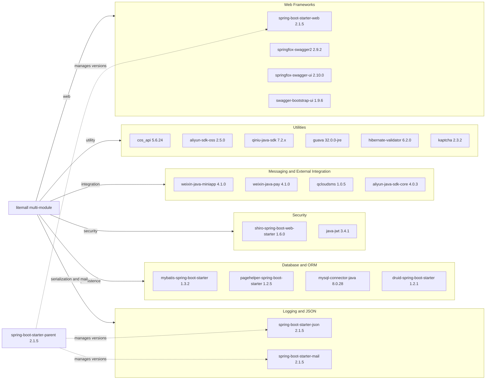

# Dependency Map

This Java multi-module application declares a Maven-managed dependency set centered on Spring Boot and MyBatis, with approximately 26 distinct non-test external libraries and 4 explicit test-scope libraries.

## Dependencies

### Dependency Summary

| Category | Count | Key Libraries | Notes |
|---|---:|---|---|
| Web Frameworks | 4 | Spring Boot Web, springfox-swagger2, springfox-swagger-ui | Both admin and wx APIs publish REST and Swagger UI |
| Database and ORM | 4 | MyBatis starter, PageHelper, MySQL driver, Druid | Shared relational persistence in `litemall-db` |
| Security | 2 | Apache Shiro, java-jwt | Mixed session and token authentication model |
| Messaging and External Integration | 4 | weixin-java-pay, weixin-java-miniapp, qcloudsms, aliyun-java-sdk-core | Payment, SMS, and cloud API integrations |
| Utilities | 6 | guava, hibernate-validator, qiniu-java-sdk, aliyun-sdk-oss | Validation and object-storage provider SDKs |
| Logging and JSON | 2 | spring-boot-starter-json, spring-boot-starter-mail | Core serialization and mail notification support |

### Version & Compatibility Risks

The stack is anchored to Spring Boot 2.1.5 and older springfox releases, which are significantly behind current supported versions and may face Java 17 plus compatibility constraints. Legacy testing dependencies such as Mockito 1.x and PowerMock 1.6.x also indicate older test infrastructure that can complicate framework upgrades.

### Notable Observations

- The root `pom.xml` centralizes many dependency versions while module poms often inherit versions implicitly.
- Multiple cloud storage SDKs are included concurrently (COS, OSS, Qiniu), increasing transitive dependency surface.
- Both session-oriented security (Shiro) and token-oriented security (JWT) are used in different API modules.
- Custom MyBatis generator plugin usage in `litemall-db` suggests generated mapper model churn is part of normal development.

## Test Dependencies

| Framework | Version | Notes |
|---|---|---|
| spring-boot-starter-test | inherited from parent | Base Spring testing support |
| powermock-api-mockito | 1.6.6 | Legacy static mocking approach |
| powermock-module-junit4 | 1.6.6 | JUnit4 runner integration for PowerMock |
| mockito-core | 1.10.19 | Older Mockito generation |

Total test-scope dependencies: 4

The project has explicit test libraries, but the stack is legacy and may require modernization before moving to newer Java and Spring testing practices.
